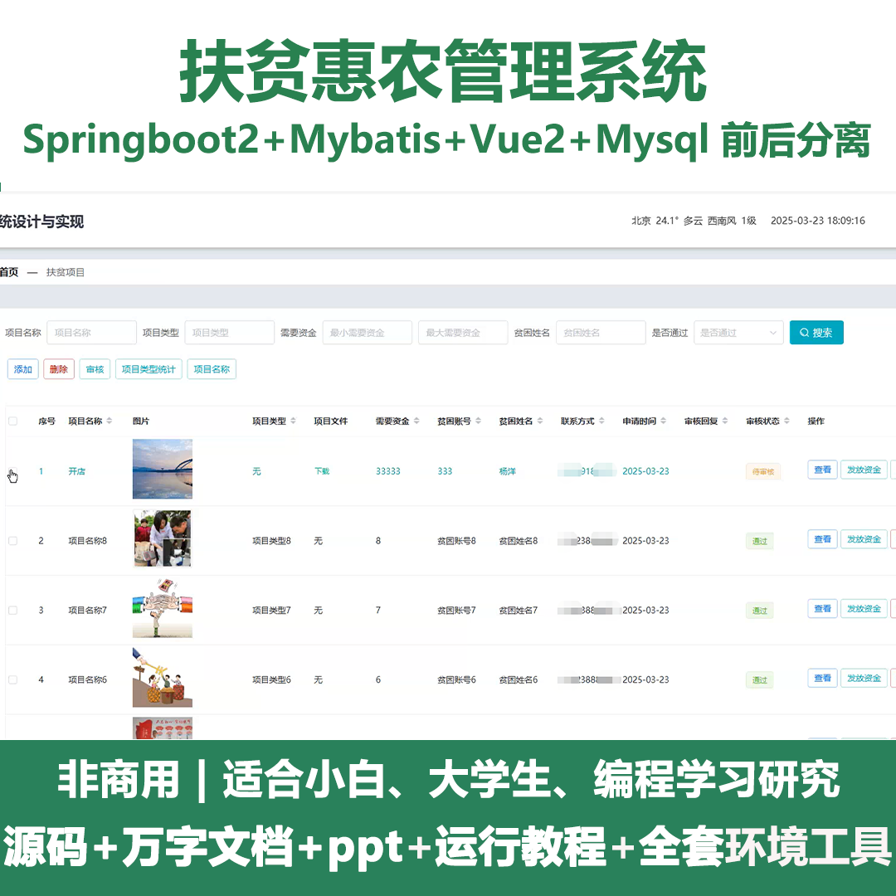
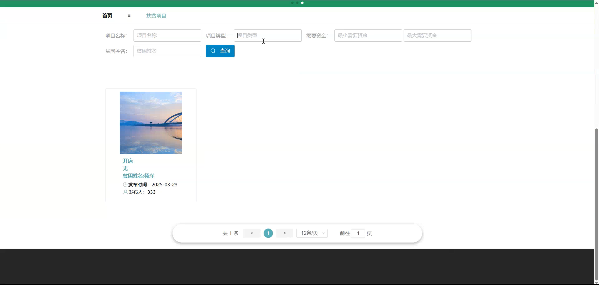
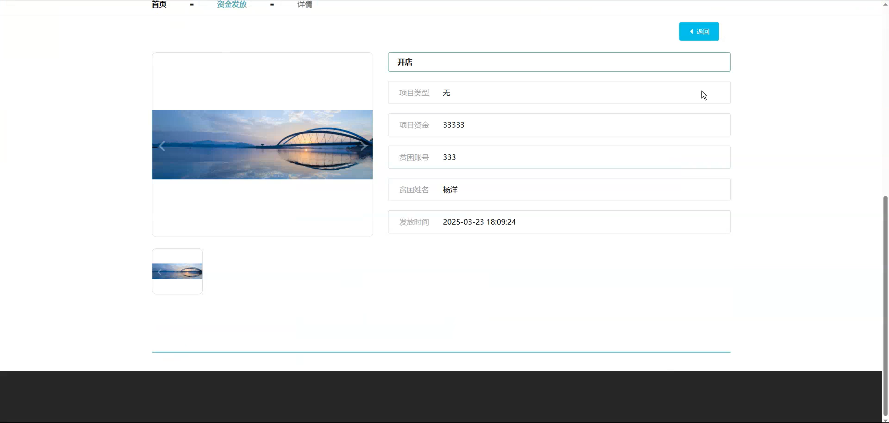
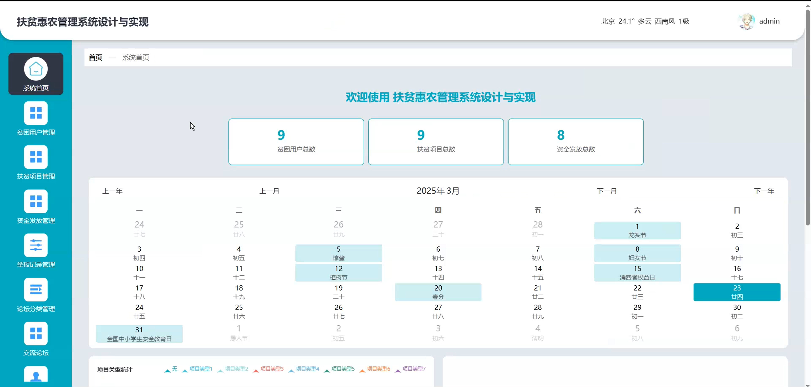
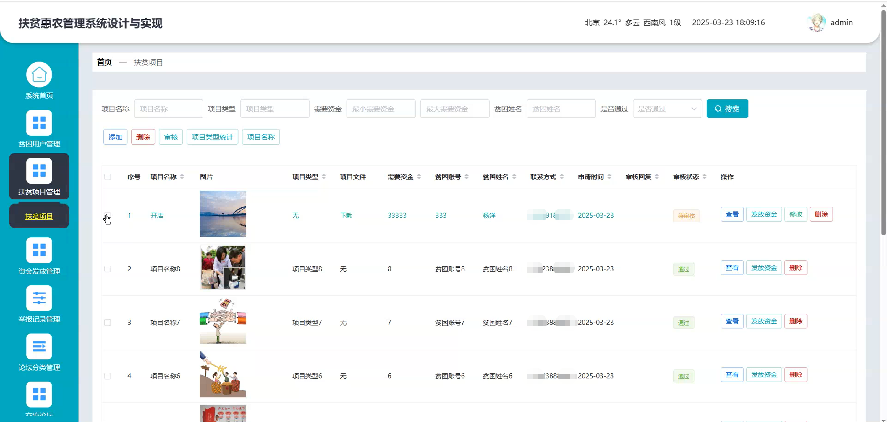
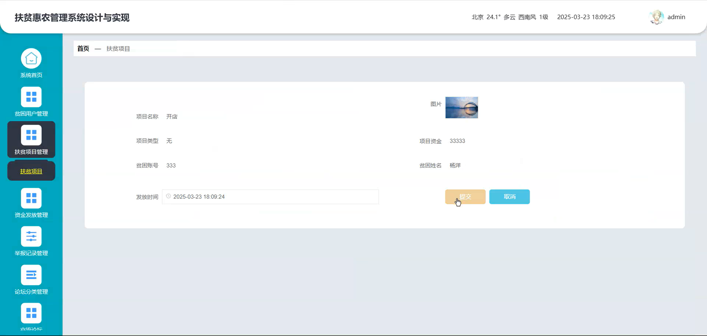
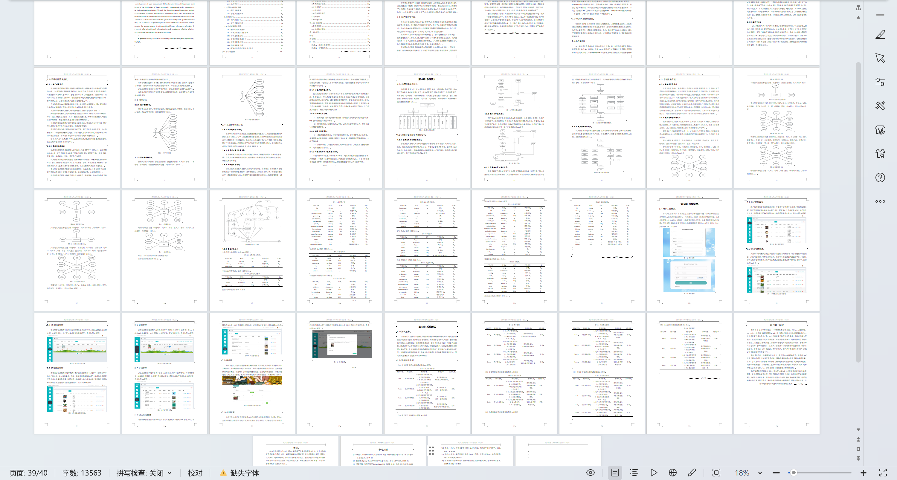

# springbootA440D
springbootA440D小说推荐系统+LW+PPT
 
## 查看主页获取源码

### 一、关键词
小说类型、小说公告信息、小说信息

### 二、作品包含
源码+数据库+设计文档万字+ppt+全套环境和工具资源+本地部署教程

### 三、项目技术
前端技术：Html、Css、Js、Vue2.0、Element-ui 
后端技术：Java、SpringBoot2.0、MyBatis

### 四、运行环境（以下版本亲测，其他版本未知，请自测）
开发工具：IDEA/eclipse  + VSCODE

数据库：MySQL5.7（最低要5.7版本）

数据库管理工具：Navicat10以上版本

环境配置软件： JDK1.8 + Maven3.6.3

前端Nodejs：14

浏览器：谷歌浏览器

### 五、项目介绍
项目编号：springbootA440D

小说推荐系统的推送用户感兴趣的小说，以提升用户阅读体验和内容发现效率。

角色：管理员、用户

管理员：系统首页、个人中心、用户、小说类型、小说信息、系统管理。

用户：系统首页、小说信息、公告信息、个人中心 、修改密码 、我的收藏。

### 六、运行截图

